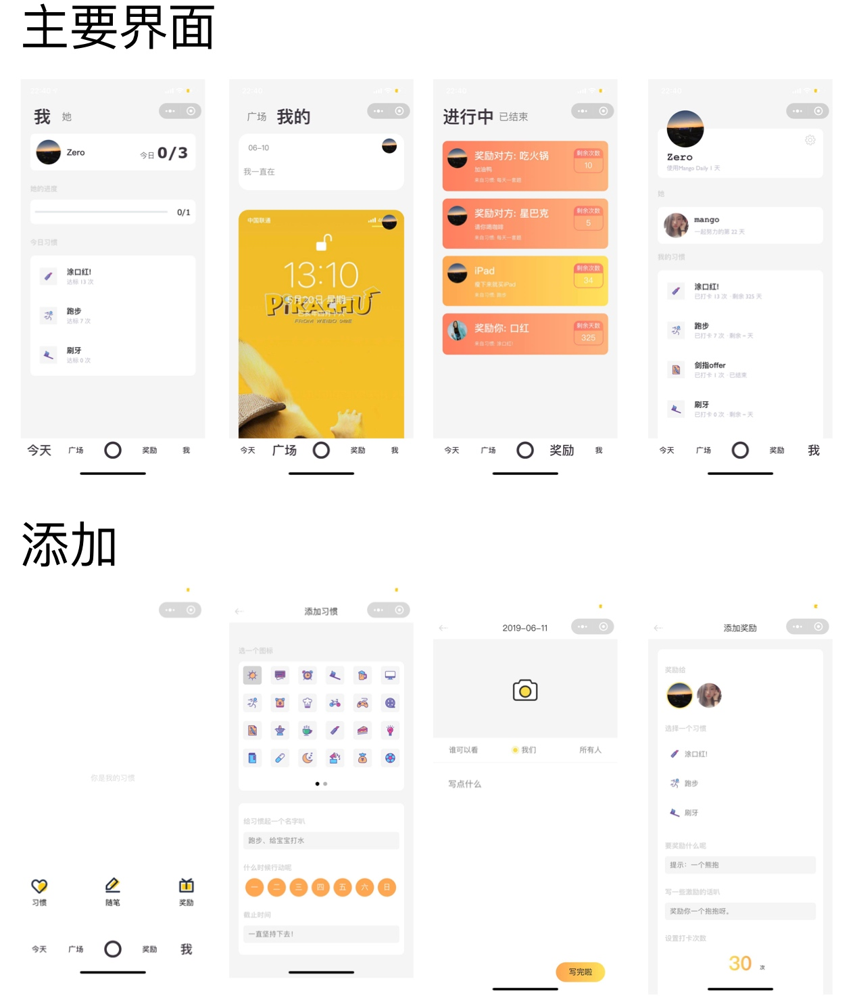

<center></center>

# We Daily  「微日常」 -- 作品介绍文档

> 🔥 2019中国高校计算机大赛-微信小程序应用开发赛 华北赛区一等奖。
> 
> 项目在上传到Github之前做了脱敏操作。当然，连项目名也做了脱敏。原xxxxx Daily改名为We Daily。
> 
> 开发笔记1: [WeApp – 2019小程序应用开发赛总结](https://www.xuzhengke.cn/archives/667)
> 开发笔记2: [「高校开发者」小程序 + 云开发 = 个人开发者快速创作的平台](https://www.xuzhengke.cn/archives/725)


## 项目运行

本项目采用小程序云开发实现。云开发与appid关联，所以请先填入自己的appid

```
// 在project.config.json修改

// ...
"appid": "输入自己的appid",
// ...
```

第二步，创建集合


| 集合名 | 集合权限设置 |
| --- | --- |
| Article | 所有用户可读，仅创建者可读写 |
| Award | 所有用户可读，仅创建者可读写 |
| FormID | 所有用户可读，仅创建者可读写 |
| Habit | 所有用户可读，仅创建者可读写 |
| Partner | 所有用户可读，仅创建者可读写 |
| Record | 所有用户可读，仅创建者可读写 |
| User | 所有用户可读，仅创建者可读写 |

因为要实现双人打卡，很多数据都需要被绑定的小伙伴看到，所以基本都做了最高权限。


## 项目名称

We Daily

“中文别名: 微日常”

原名: xxxxx Daily

***

## 项目介绍

We Daily 是一款提供 ***双人互动*** 打卡，设置奖励，分享日常的小程序。

与目前市场上存在的大部分习惯日常类应用不同的是，我们更希望互相绑定的两个用户之间去完成一些日常活动。例如在完成自己的每日任务时，可以查看对方的打卡进度，提醒对方及时完成任务；或者可以根据任务为对方制订一套奖励计划，鼓励对方按时完成任务。另外，你可以在广场记录当天完成的任务，发生的故事，这可以只在你与同伴之间分享，也可以设置允许其他人阅读。

另外，We Daily 虽然更侧重于两个用户完成绑定后使用，但是其中的所有功能也都可以一个人完成。你可以自己打卡，自己给自己设置奖励。 

在第一次使用本小程序时，你可以设置一个分享海报，邀请小伙伴与你进行绑定。绑定的双方也可以随时解除关系。

***

## 功能介绍

### 习惯

* 编辑习惯列表
* 查看自己/对方打卡进度
* 打卡

 * 完成自己的任务
 * 提醒对方打卡

* 查看打卡记录

### 奖励

* 查看进行中/已结束奖励
* 为自己/对方添加奖励

### 广场

* 大厅/个人中心 文章列表
* 添加文章

### 设置

* UI设置
* 绑定关系管理

***


## 详细功能介绍

> 因为本小程序既可单人运行，又可双人交互，所以在下方的介绍中，除特殊说明外，所有功能都是在双人绑定的状态下运行。


### 详细介绍

1. 登录
2. 个人中心
3. 设置
4. 邀请好友
5. 习惯操作
  
    1. 添加习惯
    2. 个人打卡
    3. 查看对方习惯
    4. 提醒对方打卡
    5. 查看对方打卡记录

6. 广场

    1. 添加文章
    2. 文章浏览

7. 奖励

    1. 添加奖励
    2. 查看奖励

***

### 部分截图 (后续补充)

<center></center>


#### 如果有什么问题，请加微信

<center></center>

